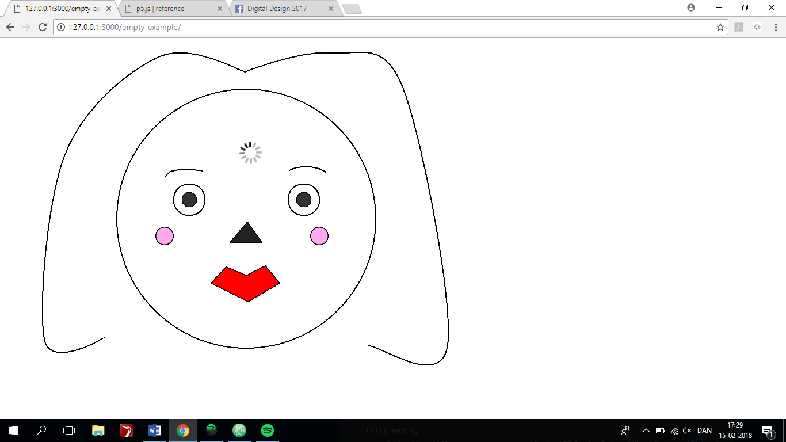

Screenshot
 
Link: https://rawgit.com/MathildeFN/mini_exes/master/mini_ex2/empty-example/index.html

I have made a fun draw, illustrating a face of a woman with a loading sign in the forehead to symbolize “thinking overload”. The draw is made of simple shapes using curveVertex, vertex and ellipses, and some of them have been filled with some color. I have used control.log (mouseX, mouseY) to find the coordinates for my shapes and their positions. Additionally, I have added a gif to my draw, to give my draw a fun edge. 

By making this fun draw I have learned to create my own shapes, and to figure out how to place them and draw them where and how I wanted them to be. At the same time I have also learned to upload my own images and gifs to the program, and place them where I want them to be. 

My program addresses Goriunova’s notion of fun primary through humor. I wanted to draw a simple face of a woman, with a loading sign in the forehead to represent how programming, coding and technology in general is slowly loading in my head.  I find this slightly fun both because of my lack of ability to program and code a beautiful drawing and the fact that I study digital design, though I have such little knowledge and ability when it comes to technology – but hopefully I will learn a lot through this study and eventually improve my skills. 
