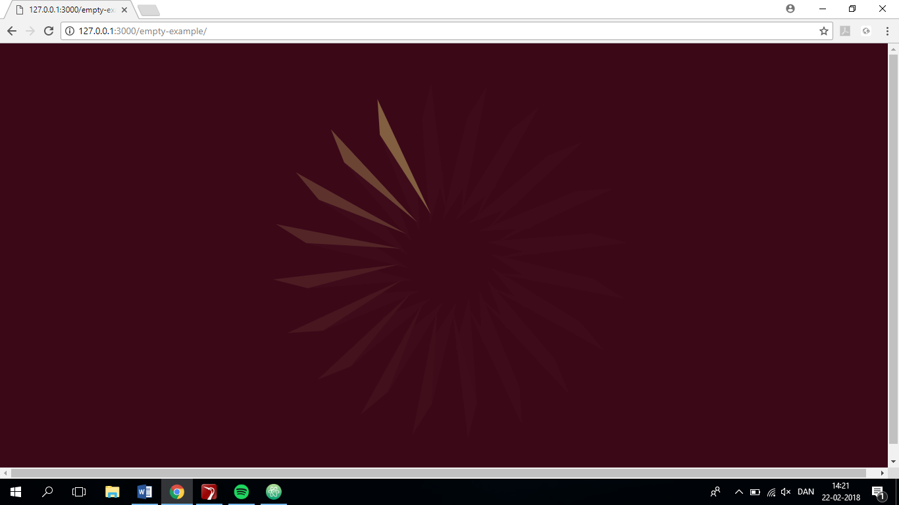

https://rawgit.com/MathildeFN/mini_exes/master/mini_ex3/empty-example/index.html

My throbber design consists of triangles running in a circle. My throbber design also has an interaction aspect; when you move the mouse across the screen the triangles will change color and shape. 
To draw the throbber I have created my own function, where I have used the translate syntax to specify the amount to displace my objects within the display window. I have also used 360/num to decide the degree of each triangle move and frameCount%num to get the remainder that indicates the movement of the triangle. I also used rotate(radians) to make the triangles rotate 360 degrees. To decide the speed of the throbber I have used framerate under function setup. To create the shapes in my throbber I have used the triangle syntax and changed their values to reshape them and added some different fill color. To make the interaction aspect I have used the if and else syntax to create conditions for when the triangles must change shape and color in relation to the positions of the mouse. 

When thinking of throbbers encounted in the digital culture, I think what the throbber is supposed to tell us basically is to wait. The throbber also tell us that the device we use is working and trying to load the action we have called for. The thing about the throbber which can make it seem slightly annoying, is the fact that you can’t tell how long time you are going to be waiting for it to load. There is nothing signifying the progress of the load, which means that you don’t have much to take a position on.  
If we are to think of the throbber icon differently, it might be to consider it more as a positive thing rather than an annoying mill slowing down our activities on the web. We could probably think of it more like a positive symbol showing that the device we use actually is working on the action that we call for, and that we at the same time get a little minibreak from our (work)activities.
