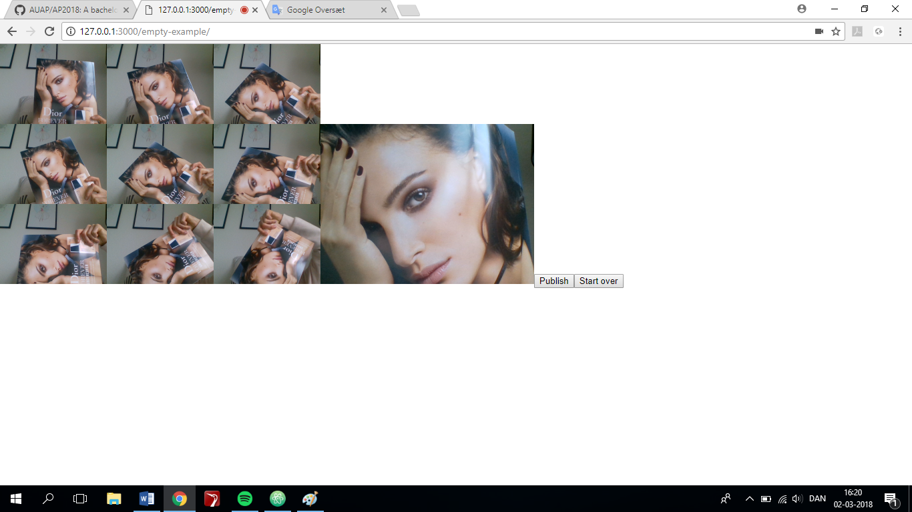

Screenshot:
 

Link:

**Describe about your sketch and explains what have been captured both conceptually and technically:** 

I have created an interactive program consisting a webcam, a canvas and to buttons you can press. When clicking the button “Publish” a snapshot of the webcam is taken, which will be posted in the upper left corner of the canvas. When clicking the button again, a new snapshot is taken and posted next to the first snapshot and so it will continue. When the canvas is full, the next picture will again appear in the upper left corner on top of the first snapshot you took. There is also a button called “Start over” which makes the new snapshots start over and they will again be posted from the upper left corner no matter where in the snapshot process you are, so that you can always start over. To clear the canvas you have to update the website. 

To create my program, I have used the syntax createCapture(VIDEO) to use the webcam as my capturing source. To create my buttons, I have used the syntax createButton and given them the name of their function. To decide the size and how many snapshots there is being published until it starts over, I have used the syntaxes For loops, Counter and if statements beside that I have used a bunch of variables to control my codes.

The idea behind creating this kind of camera-memory-board with a bunch of selfies, is a kind of a critic to how we our self ,is at least partly responsible for all the capturing and storages of personal data, because we our self, chose to take pictures and post them, or chose to write, comment or like something in the social platforms, which is all being captured and probably used by a lot of people we don’t even know – so my program kind of shows how we our self, chose to press a publishing button and thereby capture and share our data. Thereby my program underlines and visualizes how data is being captured, by showing the pictures on a canvas, though it also illustrates that we must press the button our self, to be captured and published. 

**How might this ex helps you to think about or understand the data capturing process in digital culture?**

By reading the two texts “Button” and “The like economy: Social buttons and the data-intensive web” and making this mini-ex, I have got a better understanding of what this data capturing process in digital culture is all about, and simultaneously it has made me think more about what it means. 

Both the text “The like economy: Social buttons and the data-intensive web” and “Button” inspired me in creating my program. The buttons are illustrating how we ourselves have an impact on what we chose to capture and publish on the web, and the canvas, with a bunch of snapshots, illustrates the contemporary social-web-culture, where we regularly post things and where we constantly are staging ourselves. 

The fact that I have created a button, is signifying a potential interaction, but it also indicates a functional control; that something will happen as a result of the user pressing it – and by giving the buttons names, I have indicated which results will happen by pressing the buttons – so in this case it is very predictable what will happen by pressing the buttons. Though I am aware that not all buttons on the web is quite as predictable or clear as the one I have created, like the example shown in “Button” on p. 34,  about having to click an “I accept”-button in terms of accepting a bunch of paragraphs to continue your activity on a webpage, where you don’t have any other way of answering it,  by for example that you partially agrees, that you have not realized the consequences of accepting or even that you don’t care – in this sense buttons are verbs that only makes one answer possible, and thereby rule out other (probably) more sophisticated ways in which our language expresses activity. 

As I mentioned earlier, my work is a critic of how we ourselves is responsible for our data being captured and stored, because we chose to click the button that publishes the data. Though I am aware that all of the consequences by publishing data to the web, isn’t quite as obvious to the user. As it appears in the text “The like economy: Social buttons and the data-intensive web” on p. 1360, the rise of the social web, has made companies realize how everyday online activities is able to provide a rich source of information about user preferences, habits and affects, which previously only have been available through consumer research techniques. All this user-data is now being captured for companies, for them to learn about user preferences, to improve their company. This doesn’t stand very clear to the user, when publishing or clicking buttons on the web, which might justify the argument that we aren’t totally responsible ourselves for all the capturing and storages of our personal data on the web – though we have probably somewhere, long time ago, accepted some terms with hundreds of paragraphs where this might have been described to the user – if he/she would have taken time to read it through before accepting it. 
