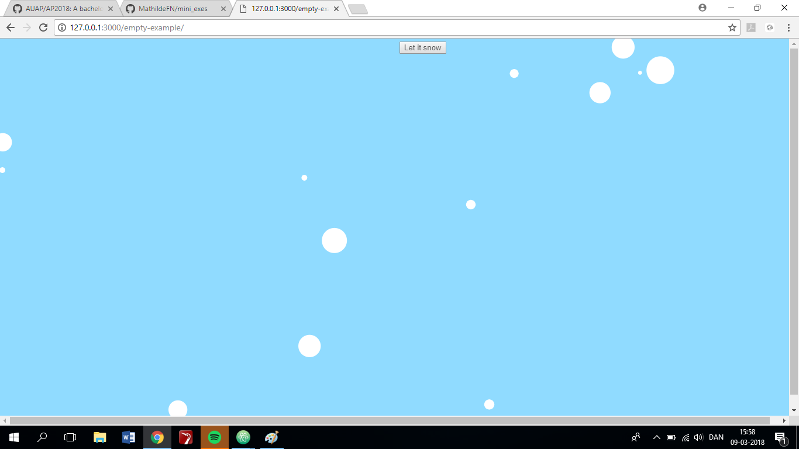

**Screenshot:**

 

**Link:**
https://rawgit.com/MathildeFN/mini_exes/master/mini_ex5/empty-example/index.html

**Describe how does your game/game object work:**

I have created a “game” called “Let it snow” – by clicking the button on the screen, you can make it snow even more – the more you click the button, the more snow will appear.

**Describe how you program the objects and their related attributes and methods in your game:**

To create my game object, I started to create to variables: “snow” and “button”, because these were the two elements I wanted to be represented on the screen. Then I created a canvas and the clickable button and called it “Let it snow”. Then I defined my variable “snow”, by naming its color, speed, positions and size. I also defined my objects methods (that it should be able to snow, and be displayed) and the function of the button (that by clicking it, more snow will appear). Then I created a Class called “Snow”, where to I have created a constructor to define my object; its color, speed, positions and size and described its related attributes and methods.

**Based on Shiftman's videos, Lee's text and in-class lecture, what are the characteristics of object-oriented programming?**

Objects are designed to manage data and carry out operations. Object oriented programming allows creation of objects that represent only a part of the real-world objects. It describes the “outside view” of an object, and the objects inner working, or encapsulated information. 
In computer programming, an object is an entity with attributes, that belong to and describes it. These attributes can be actions which the object is capable of performing, and interface to access those attributes and actions and a unique identity.
An object is a specific instance of a class, which can be thought of as a blueprint for that object - each object has a unique identity. Objects are able to both change states and react to state changes through methods. An object's constructor is the actual method that handles the creation and initialization of the object, it physically places that object into the computer's memory.
A class is the concept behind an object, while an object itself is a physical entity with a place in space and time. Objects depends on its class which means that the object couldn’t exist without the class that it is derived from – so the class must be defined before the object can even be conceived.

