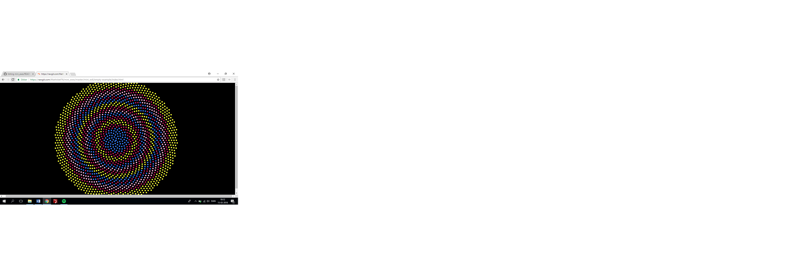

**Screenshot:**
 

**Link:**
https://rawgit.com/MathildeFN/mini_exes/master/mini_ex6/empty-example/index.html

**Readme:**
I have tried to create a program creating a pattern of florets in a sunflower head, proposed by the formula φ = n ∗ 137.5◦ , r = c √n; 
-	n is the ordering number of a floret, counting outward from the center.
-	φ is the angle between a reference direction and the position vector of the nth floret in a polar coordinate system originating at the center of the capitulum. The divergence angle between the position vectors of any two successive floret is constant a= 137,5 degrees. 
-	r is the distance between the center of the capitulum and the center of the nth floret, given a constant scaling parameter called c.

**In my code:**

-	φ is called a, and is the angel in which the ellipses are applied.
-	n is the number of the ellipses, which is the ordering number of a floret, counting outward from the center
-	c is the number of scaling pattern
-	r is the radius (the distance between the center of the capitulum and the center of the nth floret) given a constant scaling parameter c. Sqrt stand for square root.
-	c is the number of the scaling parameter

By running my program a pattern of florets in a sunflower head is created, and you can changes the colors of the ellipses by pressing the arrow keys. 

**Rules:** 
1.	My program should follow the formula: φ = n ∗ 137.5◦ , r = c √n;
2.	Each new ellipse should be applied at the fixed angel (called a) with a respect to the preceding floret
3.	The position vector of each new ellipse should fit into the largest existing gap between the position vector of the previous ellipse. 
4.	When you press the up arrow the ellipses should change color
5.	When you press the left arrow the ellipses should change color
6.	When you press the down arrow the ellipses should change color
7.	When you press the up right the ellipses should change color

**My reflections upon generativity:** 

This mini-exercise has given a better understanding of what generativity might be, in the sense that by making some rules and implementing them in a code, a generative piece of art appears as the outcome. 
I think my program opens a reflection upon the authorship of my work, both because of the fact that the code is constantly generating itself, but also by the fact that the user is able to make an impact on the art work, by changing the colors of the ellipses by pressing the arrow keys. This makes you question who the author of the art work really is; is it the one who created the code, or is it the program and computer running the code or is it the user deciding which colors the ellipses appear in?
What I also find interesting about generativity is the emergence and processes of the generative art you create. It is interesting how things in your final program appears, because of a set of rules you have made, and how it turns out to be, when the program keeps on following these rules. I think it would be funny and interesting if you somehow would be able to create a pattern breaker, that would make the program more unpredictable – I know you can use the syntaxes random and noise, to create some kind of unpredictability, but I think it might be interesting if you could take it further than that. 
