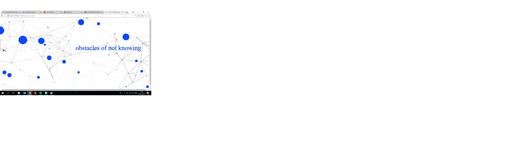

**AESTHETIC CONFUSION**
by Line and Mathilde

**Screenshot:**

 **Link:**
https://rawgit.com/MathildeFN/mini_exes/master/mini_ex7/empty-example/index.html

**What is the aesthetic aspects of your program in particular to the relationship between code and language?**

Our program called "Aesthetic Confusion" is based on the brainstorm we made in the very first class of Aesthetic Programming. The idea is to visualize our expectations, the great lack of understanding and our ignorant about programming when we started this course. Our program then consists of the text from the brainstorm, appearing at random places, in random sizes and colors, to illustrate both our thoughts from the starting point of the course, but also to illustrate the great confusion programming have been given us during the course, by choosing to randomize how the text will appear on screen. The fact the text appears in a lot of different colors, is also something we have chosen to do, to embrace the aesthetic perspective of programming, which is one of my favorite parts. Regarding our background, we have chosen a picture with interconnected lines, which is supposed to illustrate our learning process in programming – how we constantly build new pins/tools upon our repertoire, and how that enables us to create more complex code, but also enables us to think about code and languages more conceptually. 

When thinking about code and language conceptually in an aesthetic perspective, I find it interesting to look at, all the text that is written in the code compared to what text actually appears in the final program. If you take our program as an example, we have 36 lines of code, but it is only the text in the code line no. 1 which is literally shown. The rest of the text/code is though executed by shapes, movement, positioning, color, framerate and so on. So the code wouldn’t work without the rest of the 36 lines, which make those lines just as important, as the line containing the illustrated text. In extension of that I find it interesting that the text which is shown, is something the computer not fully understands. The computer just knows that this piece of code is something it is supposed to show in the final program – and then the text/code the computer actually understands, is then the text that is not showed in a literate way  – though it is executed in another way, namely by shapes, movement, colors, positions, framerate etc. in the final illustration of the program. So in this case you might say that the human/natural languages creates the static aspects of the program, while the computer/artificial languages creates the dynamic and aesthetic dimensions of the program.
