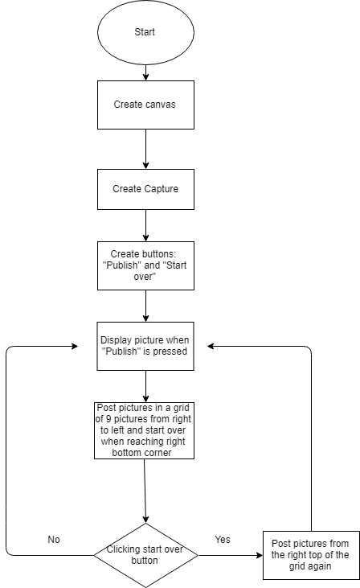
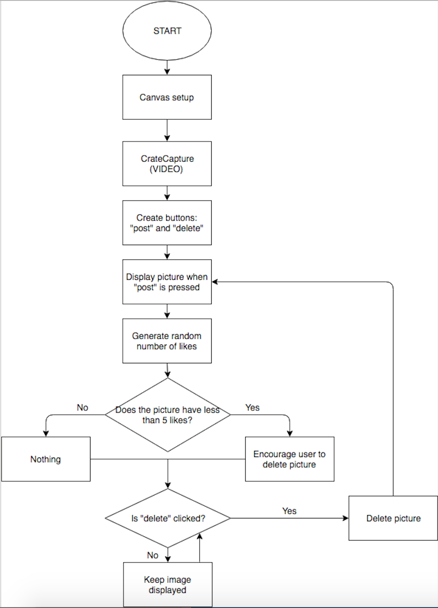

**Flow charts**

Flow Chart of my mini ex4

 

Hyperlink to mini_ex 4

[a link](https://github.com/MathildeFN/mini_exes/tree/master/mini_ex4)

**What may be the difficulty in drawing the flow chart?**
The difficult part of drawing a flowchart is to divide the code into different step, in the right order, and at the same time explaining difficult syntaxes.

**Group work:**

**The Female Body** 

The idea of this program is a generative set of sentences that describe different kind of female bodies, but always end by declaring that the body is beautiful and feminine (or something like that). The sentences will follow a formula for how the sentences are structured to make sure they make sense. The text will be divided into verses constructed of three or four sentences. When the fourth verse has been generated the screen will clear and a new set of verses will be generated. 

 

**Data capture**

The second idea is about data capture using the webcam. We want to create two buttons; a “post” button and a “delete” button. When clicking the “post” button, the picture is posted in the side of the screen. The program will then randomly give the pictures likes. If a picture has less than 5 likes, a text will appear encouraging you to delete this picture. If you click the “delete” button the picture will be deleted and if not, it will be kept. 

 

**The balance between simplicity and complicity**

The balance between simplicity and complicity in our two ideas for our final project, is so that our coded program is made quite simple, whereas our conceptual thoughts about our programs is more complex. We have worked out our ideas by starting with a conceptual idea and theme, and thereby we have brainstormed ideas to illustrate our statements in a simple way. 

**The technical challenges**

The technical challenges for our idea about the generativity project, might be to make the text appear the way we want to, and make it generate some sentences that all makes sense, and display them in a speed that makes it possible for the reader to read them properly before they disappear. 

In the other idea about data capture, the technical challenge might be to get our ideas about the like selection and the buttons to work intentionally so that our conceptual idea gets visualized.  

**Individual part:**

The difference between my flowchart and those from the group work (in terms of the role of a flow chart)?
The way my flowchart differs from those made in collaboration with my group, is the order of making the flowchart and the program. In the group we started thinking of a conceptual idea, and therefrom created a flowchart, to set the frames for a program, whereas I have made a flowchart after creating the program. 

If you have to bring the concept of algorithms from flow charts to a wider cultural context, how would you reflect the notion of algorithms? (see if you could refer to the text and articulate your thoughts?)
Algorithms in a wider cultural context and reflections on the notion of algorithms

